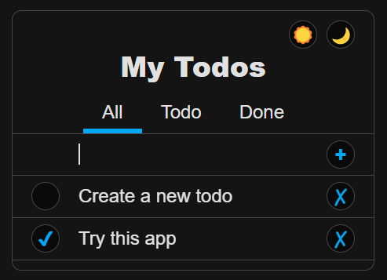

# Idris 2 UI

Make declaritve UIs in Idris 2!

This library aims to provide the developer experience inspired by react native.

## ROADMAP

- [x] basic web devolpment
- [x] recompile on save (manual realoda in browser still needed)
- [ ] inspector
- [ ] basic mobile develpment

**DISCLAIMER ⚠️**
This project is meant for inspiring production-ready packages and as a testing ground for iterations to reach the best developer experience possible.
Iterations code is all kept, in separate packages.

## TODO APP

| [try it online](src/Demo25/doc/todo.html) | [source](src/Demo25/TodoApp.idr) |
| ----------------------------------------- | -------------------------------- |



# Usage

- clone this repository
- [dev machine setup](DEV-MACHINE-SETUP.md)
- run `./watch-build.sh`
- edit [source file](src/Demo25/Usage.idr) and save
- open [output file](build/exec/index.html), reload after save (wait for compiler to finish)

```idris

module Demo25.Usage

import Demo25.UI.View
import Demo25.UI.Browser.View

import Demo25.TodoApp

--- Hello world

HelloWorldApp = Text "Hello World"

--- Naive Routing

namespace NaiveRouting

  data Route = HomeRoute | AboutRoute

  HomeScreen = Text "Home"

  AboutScreen = Text "About"

  matchRoute : Route -> View
  matchRoute HomeRoute = HomeScreen
  matchRoute AboutRoute = AboutScreen

  export
  NaiveRoutingApp : View
  NaiveRoutingApp = do
    (currentRoute, setCurrentRoute) <- useState HomeRoute
    Flex Col [
      Flex Row [
        Text {press = [setCurrentRoute HomeRoute]} "Home",
        Text {press = [setCurrentRoute AboutRoute]} "About"
      ],
      matchRoute currentRoute
    ]

--- Component instances

Counter : {default 1 step : Int} -> View
Counter = do
  (count, setCount) <- useState (the Int 0)
  Flex Row [
    Text "\{show count}",
    Text {press = [setCount(count + step)]} "+\{show step}"
  ]

ComponentInstancesApp = Flex Col [
  Counter,
  Counter {step = 2}
]

--- Simple todos

SimpleTodosApp = do
  (text, setText) <- useState (the String "")
  (todos, setTodos) <- useState (the (List String) [])
  let addTodo = [
    setTodos (text :: todos),
    setText ""
  ]
  Flex Col [
    Flex Row [
      Input text (\text => [setText text]),
      Text { press = addTodo } "add"
    ],
    Flex Col $ (flip map) todos $ \todo => Text todo
  ]

--- Routing

namespace Routing

  interface Route where view : View

  navigateContext = createContext (Route -> List StateUpdate)
  routeContext = createContext Route

  Link : (to : Route) -> (content : String) -> View
  Link to content = do
    navigate <- navigateContext
    Text {press = navigate to} content

  Router : (initial : Route) -> (render: (outlet : View) -> View) -> View
  Router initial render = do
    (currentRoute, setCurrentRoute) <- useState initial
    let navigate = \to => [setCurrentRoute to]
    let contextProviders = (Provider navigateContext navigate) . (Provider routeContext currentRoute)
    contextProviders (render (view @{currentRoute}))

  ---

  [Home] Route where
    view = Text "HOME"

  [About] Route where
    view = Text "ABOUT"

  [Product] {id : String} -> Route where
    view = Text "PRODUCT \{id}"

  [Counters] Route where
    view = Flex Col [
      Counter,
      Counter {step = 3}
    ]

  export
  RoutingApp : View
  RoutingApp = Router Home $ \outlet =>
    Flex Col [
      Text "RoutingApp",
      Flex Row [
        Link Home "Home",
        Link About "About",
        Link (Product {id = "1"}) "Product (1)",
        Link (Product {id = "2"}) "Product (2)",
        Link Counters "Counters"
      ],
      outlet
    ]

--- Styling

StyledApp = Flex Col [
  Input {
    style = s{
      color = rgba 200 200 200 0.5
    },
    value = "",
    change = \value => []
  },
  Text {
    style = s{
      font = s{
        family = "Roboto",
        size = 32,
        weight = 800,
        style = Italic
      },
      color = rgb 255 0 0,
      align = Center,
      lineHeight = 2
    }
  } "Hello\nworld",
  Flex Row {
    style = s{
      margin = s{ all = 1, vertical = 2, horizontal = 3, top = 4, right = 5, bottom = 6, left = 7 },
      padding =  s{ all = 1, vertical = 2, horizontal = 3, top = 4, right = 5, bottom = 6, left = 7 },
      border = s{
        width = s{ all = 1, vertical = 2, horizontal = 3, top = 4, right = 5, bottom = 6, left = 7 },
        radius = s{
          all = 1,
          top = 2,
          left = 3,
          bottom = 4,
          right = 5,
          topLeft = 6,
          topRight = 7,
          bottomRight = 8,
          bottomLeft = 9
        },
        color = s{
          all = rgba 10 0 0 0.5,
          vertical = rgba 20 0 0 0.5,
          horizontal = rgba 30 0 0 0.5,
          top = rgba 40 0 0 0.5,
          right = rgba 50 0 0 0.5,
          bottom = rgba 60 0 0 0.5,
          left = rgba 70 0 0 0.5
        }
      },
      background = rgb 0 255 0,
      gap = s{ all = 1, col = 2, row = 3 }, -- aka css flex-gap
      wrap = True, -- aka css flex-wrap
      justify = Center, -- aka css justify-content
      align = End, -- aka css self-align
      grow = 2, -- aka css flex-grow
      width = s{ min = psf 0.2, max = psf 0.3 }, -- parent size fraction aka css percentage / 100
      height = dip 200 -- density indipendent pixels aka css pixels
    }
  } []
]

--- render

main : IO ()
main = do
  root <- Root.create
  root.render [
    TodoApp,
    HelloWorldApp,
    NaiveRoutingApp,
    ComponentInstancesApp,
    SimpleTodosApp,
    RoutingApp,
    StyledApp
  ]

```
